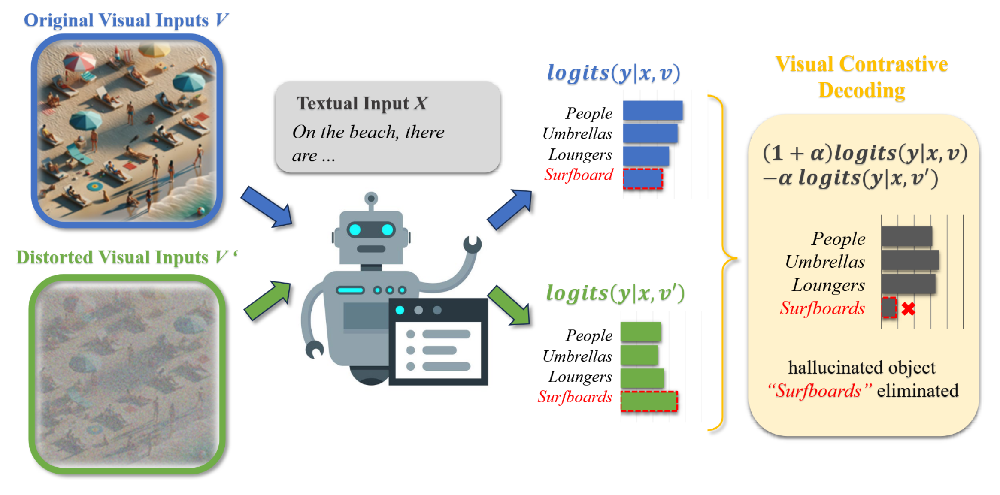
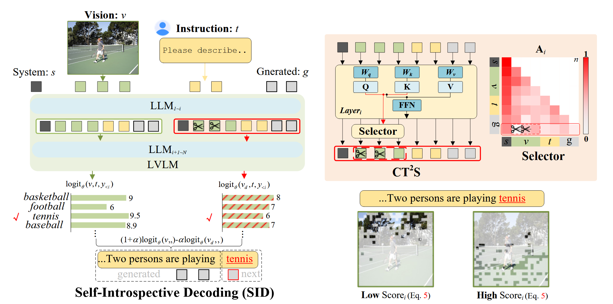

# State-of-the-art Contrastive Decoding Strategies Implementation

Contrastive Decoding is a kind of training-free strategy in the LLMs generation process for mitigating hallucination. Here, I implement some SOTA contrastive decoding strategies based on LLaVA, lmms-eval, and transformers.

## Setup

First, create a new environment with conda and clone the repository

```
conda create -n cd python=3.10 -y
git clone git@github.com:Fanziyang-v/contrastive-decoding.git
cd contrastive-decoding
```

Second, install the package using pip with editable option

```
pip install -e lmms-eval
pip install -e LLaVA
pip install -e transformers
```

## Implementation

Currently, Visual Contrastive Decoding(VCD) is implemented. The other contrastive decoding strategies such OPEAR and DOLA will be implemented soon.

### Visual Contrastive Decoding

**Authors:** *Sicong Leng, Hang Zhang, Guanzheng Chen, Xin Li, Shijian Lu, Chunyan Miao, Lidong Bing*

**Abstract:** Large Vision-Language Models (LVLMs) have advanced considerably, intertwining visual recognition and language understanding to generate content that is not only coherent but also contextually attuned. Despite their success, LVLMs still suffer from the issue of object hallucinations, where models generate plausible yet incorrect outputs that include objects that do not exist in the images. To mitigate this issue, we introduce Visual Contrastive Decoding (VCD), a simple and training-free method that contrasts output distributions derived from original and distorted visual inputs. The proposed VCD effectively reduces the over-reliance on statistical bias and unimodal priors, two essential causes of object hallucinations. This adjustment ensures the generated content is closely grounded to visual inputs, resulting in contextually accurate outputs. Our experiments show that VCD, without either additional training or the usage of external tools, significantly mitigates the object hallucination issue across different LVLM families. Beyond mitigating object hallucinations, VCD also excels in general LVLM benchmarks, highlighting its wide-ranging applicability.



### Self Introspective Decoding

**Authors:** *Fushuo Huo, Wenchao Xu, Zhong Zhang, Haozhao Wang, Zhicheng Chen, Peilin Zhao*

**Abstract:** While Large Vision-Language Models (LVLMs) have rapidly advanced in recent years, the prevalent issue known as the hallucination' problem has emerged as a significant bottleneck, hindering their real-world deployments. Existing methods mitigate this issue mainly from two perspectives: One approach leverages extra knowledge like robust instruction tuning LVLMs with curated datasets or employing auxiliary analysis networks, which inevitable incur additional costs. Another approach, known as contrastive decoding, induces hallucinations by manually disturbing the vision or instruction raw inputs and mitigates them by contrasting the outputs of the disturbed and original LVLMs. However, these approaches rely on empirical holistic input disturbances and double the inference cost. To avoid these issues, we propose a simple yet effective method named Self-Introspective Decoding (SID). Our empirical investigation reveals that pretrained LVLMs can introspectively assess the importance of vision tokens based on preceding vision and text (both instruction and generated) tokens. We develop the Context and Text-aware Token Selection (CT2S) strategy, which preserves only unimportant vision tokens after early layers of LVLMs to adaptively amplify text-informed hallucination during the auto-regressive decoding. This approach ensures that multimodal knowledge absorbed in the early layers induces multimodal contextual rather than aimless hallucinations. Subsequently, the original token logits subtract the amplified vision-and-text association hallucinations, guiding LVLMs decoding faithfully. Extensive experiments illustrate SID generates less-hallucination and higher-quality texts across various metrics, without extra knowledge and much additional computation burdens.



## Evaluation

Here is an example on using lmms-eval to evaluate LLaVA v1.5-7B with VCD on POPE dataset.

```
python3 -m accelerate.commands.launch --num_processes=4 -m lmms_eval \
    --model llava \
    --model_args pretrained="liuhaotian/llava-v1.5-7b" \
    --gen_kwargs strategy="VCD",alpha=1.0,beta=0.1,noise_step=999 \
    --tasks pope_adv,pope_pop,pope_random \
    --batch_size 1 \
    --log_samples \
    --log_samples_suffix llava_v1.5_pope_vcd \
    --output_path ./logs/
```
